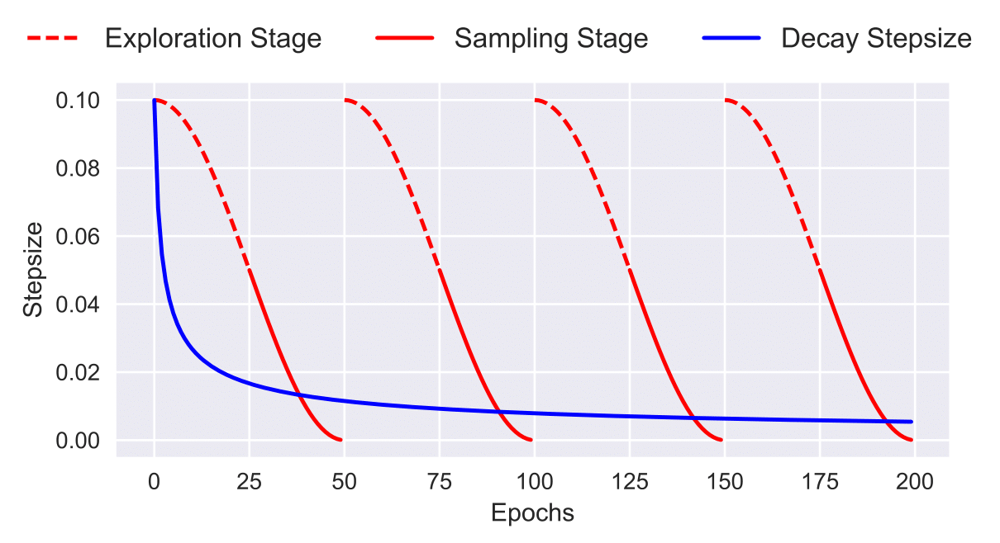
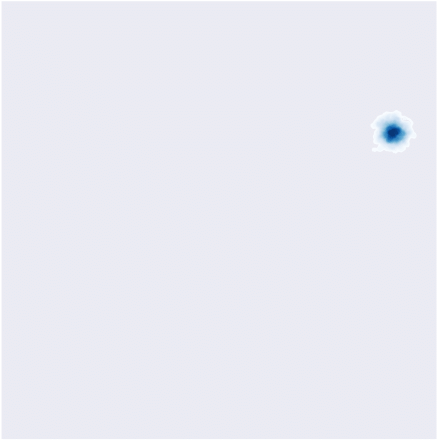
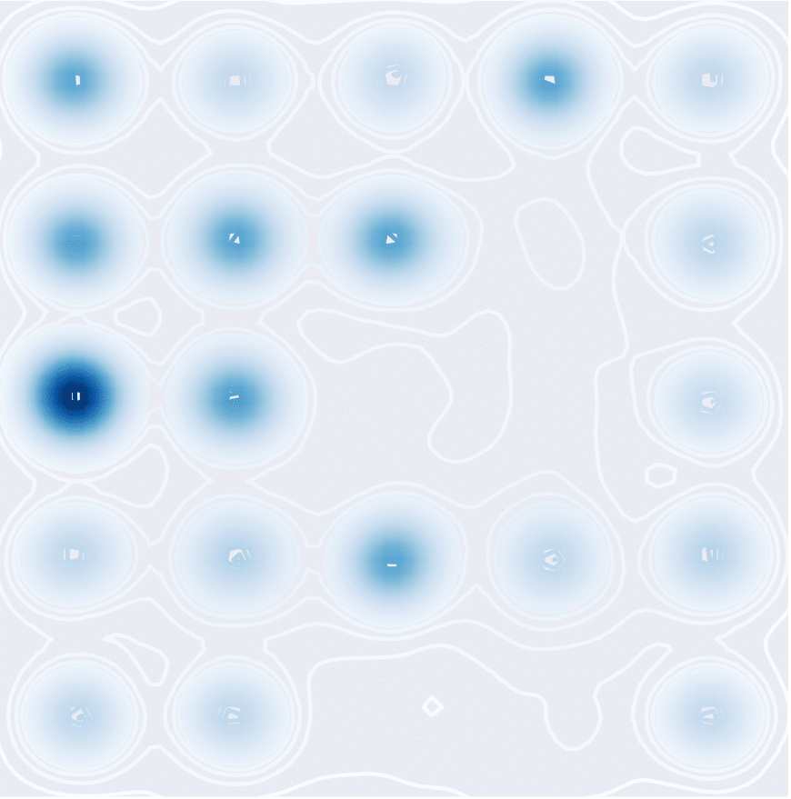
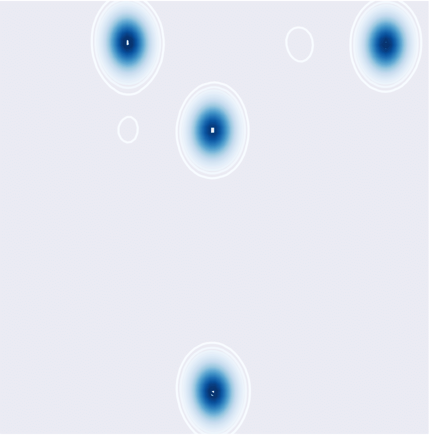
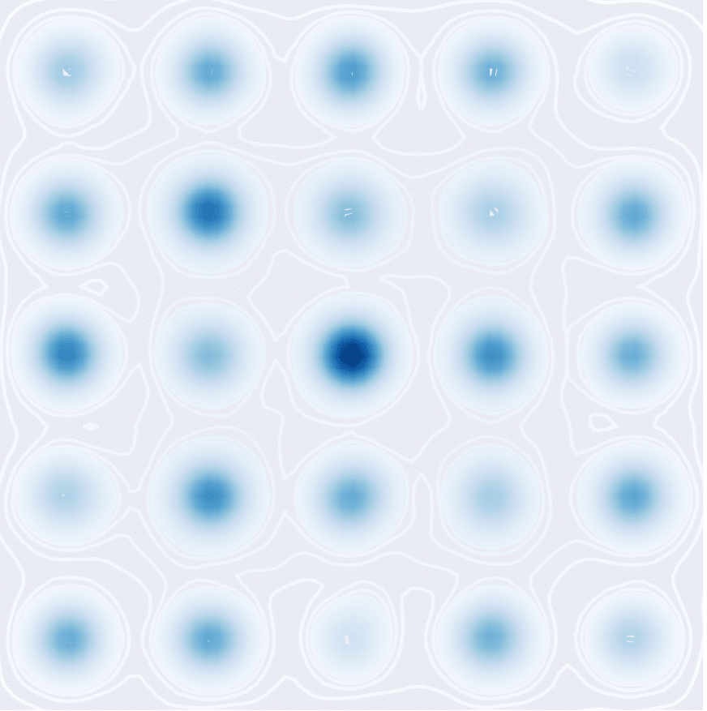

# Cyclical Stochastic Gradient MCMC for Bayesian Deep Learning

This repository contains code for the paper
[Cyclical Stochastic Gradient MCMC for Bayesian Deep Learning](https://arxiv.org/abs/1902.03932), accepted in _International Conference on Learning Representations (ICLR), 2020_ as _Oral Presentation_ (acceptance rate = 1.85%).

```bibtex
@article{zhang2020csgmcmc,
  title={Cyclical Stochastic Gradient MCMC for Bayesian Deep Learning},
  author={Zhang, Ruqi and Li, Chunyuan and Zhang, Jianyi and Chen, Changyou and Wilson, Andrew Gordon},
  journal={International Conference on Learning Representations},
  year={2020}
}
```
# Introduction
**Cyclical Stochastic Gradient MCMC (cSG-MCMC)** is proposed to efficiently explore complex multimodal distributions, such as those encountered for modern deep neural networks. 

The key idea is to adapt a cyclical stepsize schedule, where larger steps discover new modes, and smaller steps characterize each mode. We prove that our proposed learning rate schedule provides faster convergence to samples from a stationary distribution than SG-MCMC with standard decaying schedules. The figure below is an illustration of the proposed cyclical stepsize schedule (red) and the traditional decreasing stepsize schedule (blue) for SG-MCMC algorithms. The cSG-MCMC consists of two stages: *Exploration* and *Sampling*.

<p align="center">
  
</p>


# Dependencies
* Python 2.7
* [PyTorch 1.2.0](http://pytorch.org/) 
* [torchvision 0.4.0](https://github.com/pytorch/vision/)

# Experimental Results
## Gaussian Mixture Density (25 Gaussians)

To generate samples from mixture of Gaussians (single chain results), please run `experiments/mog25.m`

The two different stepsize schedules are called in lines:

```
    dsgld = sgld( gradUNoise, etaSGLD, L, x0, V );
    dcsgld = csgld( gradUNoise, etacSGLD, L, M, x0, V );
```

To visualize the results, please use ipython notebook to open the file `experiments/plot_density.ipynb`. Cached results from our runs are included.

Sampling from a mixture of 25 Gaussians in the non-parallel setting (one single chain).

|  SGLD  |   cSGLD 
|:-------------------------:|:-------------------------:
|   |   


Sampling from a mixture of 25 Gaussians in the parallel setting (4 chains).

|  SGLD  |   cSGLD 
|:-------------------------:|:-------------------------:
|   |   


## CIFAR-10
To train models with cSGLD on CIFAR-10, run:
```
cd experiments
python cifar_csgmcmc.py --dir=<DIR> \
                        --data_path=<PATH> \
                        --temperature=<TEMPERATURE>
```
To train models with cSGHMC on CIFAR-10, run:
```
cd experiments
python cifar_csghmc.py --dir=<DIR> \
                       --data_path=<PATH> \
                       --temperature=<TEMPERATURE> \
                       --alpha=<ALPHA>
```
Parameters:

* ```DIR``` &mdash; path to training directory where samples will be stored
* ```PATH``` &mdash; path to the data directory
* ```ALPHA``` &mdash; One minus the momentum term. One is corresponding to SGLD and a number which is less than one is corresponding to SGHMC
* ```TEMPERATURE``` &mdash; temperature in the posterior

To test the ensemble of the collected samples on CIFAR-10, run `experiments/cifar_ensemble.py`


## CIFAR-100

Similarly, for CIFAR-100, run

```
cd experiments
python cifar100_csgmcmc.py --dir=<DIR> \
                           --data_path=<PATH> \
                           --temperature=<TEMPERATURE>
```

```
cd experiments
python cifar100_csghmc.py --dir=<DIR> \
                          --data_path=<PATH> \
                          --temperature=<TEMPERATURE> \
                          --alpha=<ALPHA>
```

To test the ensemble of the collected samples on CIFAR-100, run `experiments/cifar100_ensemble.py`

Test Error (%) on CIFAR-10 and CIFAR-100.

| Dataset                   |  SGLD        | cSGLD        | SGHMC            | cSGHMC          |
| ------------------------- |:------------:|:------------:|:----------------:|:---------------:|
| CIFAR-10                   | 5.20 ± 0.06  | 4.29 ± 0.06  | 4.93 ± 0.1       | 4.27 ± 0.03     |
| CIFAR-100                  | 23.23 ± 0.01 | 20.55 ± 0.06 | 22.60 ± 0.17     | 20.50 ± 0.11    |


# References
* Code of Gaussian mixtures is adapted from https://github.com/tqchen/ML-SGHMC
* Models are adapted from https://github.com/kuangliu/pytorch-cifar
